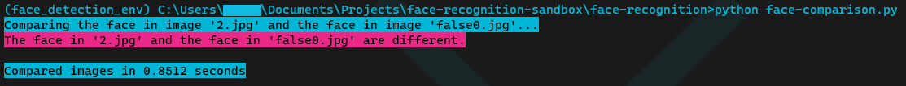

# 🐸 Face Recognition Sandbox

### `face-recognition`

Trying out simple [face_recognition](https://pypi.org/project/face-recognition/) library. Works on Intel Core i3 8100, without GPU (integrated graphics)

[face-comparison](face-recognition/face-comparison.py) script run 

[face-comparison-data](face-recognition/face-comparison-data.py) script run 

[facial-landmarks](face-recognition/facial-landmarks.py) script run 
