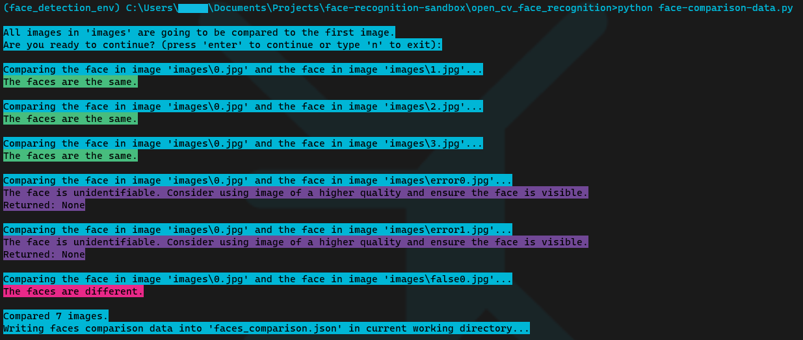

# 🐸 Face Recognition Sandbox Code and Scripts

* `open_cv_face_recognition` -- playing around with some simple face recognition using [face_recognition](https://pypi.org/project/face-recognition/) library. Works on Intel Core i3 8100 without GPU (integrated graphics). 
Example of a [face-comparison-data]("face_recognition/face-comparison-data.py") script run: 

